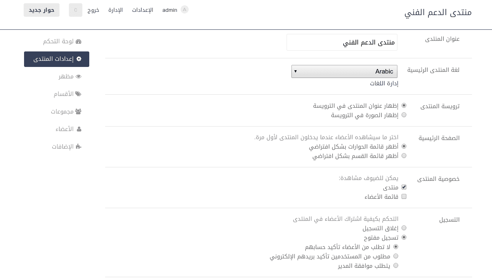

# esoTalk RTL Default Skin


Default RTL Skin for [esoTalk](http://esotalk.org) forum engine.

## Introduction
Default esoTalk skin is very nice and clean, sadly it doesn't support RTL layouts!

This is the same skin as the Default one, but with RTL css file appended to the style and **Droid Arabic Kufi** Web font added to the master instead of **Open Sans**.

## Installation

- Download the [zip file](https://github.com/AAlakkad/esoTalk-DefaultRTL-skin/archive/master.zip) and extract its content in `addons/skins`.
- Rename the extracted folder to `DefaultRTL`.
- Then go to `Appearance` in administration panel and activate the skin.

## Admin Skin

The skin by default will be used for front-end only, you can use this skin for admin panel by adding this line to your `config/config.php` file:

```php
$config["esoTalk.adminSkin"] = 'DefaultRTL';
```



## Contribution

You're welcome to [report bug](https://github.com/AAlakkad/esoTalk-DefaultRTL-skin/issues) or create a [pull request](https://github.com/AAlakkad/esoTalk-DefaultRTL-skin/pulls).